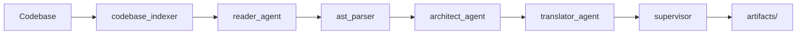

# Kiến trúc hệ thống

Mục tiêu: mô tả cấu trúc tổng thể của dự án, các thành phần chính, giao diện giữa các thành phần và luồng dữ liệu.

1. Tổng quan

   - Dự án là một công cụ phân tích/di chuyển mã nguồn (migration assistant) gồm: bộ điều phối (orchestrator), các agent xử lý (architect, reader, translator, supervisor), mô-đun phân tích cú pháp (ast_parser), lõi xử lý (core), và mô hình trạng thái (models/state).

2. Thành phần chính

   - `src/main.py`: Điểm khởi chạy ứng dụng (CLI/entrypoint).
   - `src/workflow.py`: Định nghĩa các luồng công việc (pipelines) và cách các agent liên kết với nhau.
   - `src/agents/`: Chứa các agent: `architect_agent.py`, `reader_agent.py`, `translator_agent.py`, `supervisor.py`.
   - `src/ast_parser/transformer.py`: Chuyển đổi và chuẩn hóa cây AST cho các phân tích tiếp theo.
   - `src/core/tree_sitter_engine.py`: Engine parsing và xử lý cú pháp (dùng Tree-sitter nếu có cấu hình).
   - `src/models/`: Định nghĩa schema, trạng thái và các cấu trúc dữ liệu dùng chung.
   - `src/tools/`: Công cụ hỗ trợ như `codebase_indexer.py`, `file_system.py`, `maven_upgrade_tools.py`, `visualization_engine.py`.

3. Luồng dữ liệu (Data flow)

   - Bước 1: Input codebase (đường dẫn hoặc kho chứa) được index bởi `codebase_indexer`.
   - Bước 2: `reader_agent` trích xuất file, metadata, và tạo biểu diễn sơ bộ (documents).
   - Bước 3: `ast_parser`/`transformer` xây dựng AST và chuẩn hóa cấu trúc mã.
   - Bước 4: `architect_agent` phân tích luồng tổng thể, xác định các thay đổi/upgrade cần thiết.
   - Bước 5: `translator_agent` tạo patch hoặc hướng dẫn chuyển đổi cụ thể.
   - Bước 6: `supervisor` kiểm thử các patch (tùy chọn), xác thực và ghi nhận trạng thái trong `models/state.py`.

4. Giao tiếp giữa thành phần

   - Các agent giao tiếp thông qua các lớp wrapper trong `agents/` và dữ liệu tuần tự hóa (JSON/objects).
   - Trạng thái dài hạn được lưu trong `models/state.py` hoặc lưu ra file `artifacts/`.

5. Mở rộng và plugin

   - Thiết kế cho phép thêm agent mới vào `src/agents/` theo interface chuẩn.
   - `tools/visualization_engine.py` dùng để xuất báo cáo và sơ đồ phụ thuộc.

6. Sơ đồ (Mermaid)

7. Quy ước ghi log và lỗi

   - Log ở mức INFO/DEBUG được ghi ra console và có thể chuyển vào file logs.
   - Lỗi nghiêm trọng (exceptions) phải được bắt ở rìa (edge) của mỗi agent và report vào trạng thái chung.
