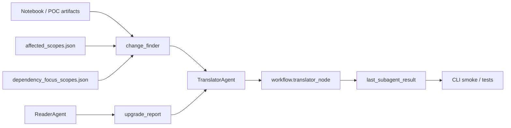

# Translator Agent Work Report

## Mục tiêu

Mục tiêu của đợt này là biến `translator` từ một agent gọi LLM đơn thuần thành một module có thể chạy được trong codebase hiện có, tận dụng các report đã có từ notebook POC để sinh change plan có cấu trúc cho dự án Java `cantor`.

## Tôi đã làm gì

Tôi đã triển khai một lớp xử lý mới cho translator để đọc các artifact hiện có và chuyển chúng thành danh sách change candidate có thể thao tác được. Cụ thể:

- Thêm module `change_finder` để gom các report `dependency_focus_scopes.json` và `affected_scopes_cantor.json` thành `change_candidates`.
- Viết lại `TranslatorAgent` để:
  - nhận toàn bộ workflow state,
  - tự dò report mặc định trong workspace,
  - sinh JSON plan thay vì chỉ trả lời tự do bằng LLM,
  - vẫn giữ khả năng enrich bằng LLM nếu có cấu hình Groq.
- Cập nhật `workflow.py` để truyền đầy đủ context sang translator node.
- Thêm script CLI smoke test riêng cho translator.
- Thêm unit test để kiểm tra cả helper lẫn agent.
- Bổ sung một cell demo trong notebook `migration_scope_poc.ipynb` để chạy translator smoke ngay trong POC.

## Phục vụ chức năng nào

Các thay đổi này phục vụ 3 chức năng chính:

1. Chuyển output discovery/scope analysis thành change plan có cấu trúc.
2. Cho phép translator chạy được end-to-end trên CLI mà không phụ thuộc vào prompt thủ công.
3. Làm cầu nối giữa notebook POC và pipeline agent trong codebase.

## Tôi đã làm như thế nào

Tôi bắt đầu bằng cách đọc các điểm nối sẵn có trong codebase: `workflow.py`, `state.py`, `reader_agent.py`, `architect_agent.py`, và các artifact của notebook POC. Từ đó, tôi thấy translator đã có nhánh trong workflow nhưng chưa có logic deterministic để xử lý report scope.

Thay vì viết lại toàn bộ pipeline, tôi tái sử dụng:

- `migration_scope_poc.ipynb` để lấy ra 2 artifact đầu vào thực tế.
- `migration_tasks` trong `GlobalState` để chứa các task migration.
- `ReaderAgent` và `ArchitectAgent` hiện có để giữ vai trò discovery và dependency analysis.

Sau đó tôi thêm `change_finder` để làm nhiệm vụ map report sang candidate. `TranslatorAgent` bây giờ lấy state JSON từ workflow, dò file report mặc định, sinh summary JSON chuẩn, và chỉ dùng LLM nếu có API key để bổ sung narrative.

## Sơ đồ luồng

## Kết quả test

Tôi đã chạy 2 lớp kiểm tra.

### 1. Unit test

File test: `tests/test_translator_agent.py`

Kết quả:

- `2 passed`
- Có warning về `.pytest_cache` permission, nhưng không ảnh hưởng kết quả test.

Test bao phủ:

- `find_change_candidates()` đọc report JSON và sinh candidate đúng file/line.
- `build_translation_report()` tạo summary đúng.
- `TranslatorAgent.run()` trả về JSON plan hợp lệ khi không có LLM.

### 2. CLI smoke test

Script: `scripts/run_translator_smoke.py`

Chạy trên project thật `freshbrew_data/cantor` với 2 artifact đã có sẵn.

Kết quả chính:

- `status: ok`
- `task_count: 2`
- `candidate_count: 2`
- `files_covered: 1`
- Candidate đầu tiên trỏ đúng vào `src/main/java/com/adroll/cantor/HLLWritable.java`

Ý nghĩa của smoke test:

- Xác nhận translator chạy được từ CLI.
- Xác nhận translator đọc được report thật từ workspace.
- Xác nhận output không chỉ là text, mà là JSON plan có cấu trúc.

## Các tool / module đã tạo

- `src/tools/change_finder.py`
- `scripts/run_translator_smoke.py`
- `tests/test_translator_agent.py`

Ngoài ra tôi đã cập nhật các file hiện có:

- `src/agents/translator_agent.py`
- `src/workflow.py`
- `src/tools/__init__.py`
- `migration_scope_poc.ipynb`

## Các agents phối hợp với nhau ra sao

- `ReaderAgent` tiếp tục làm discovery/indexing và tạo `upgrade_report`.
- `ArchitectAgent` tiếp tục làm dependency analysis và solver pipeline.
- `TranslatorAgent` nhận state đã qua phân tích, đọc report scope, và chuyển thành change plan.
- `workflow.py` đóng vai trò router, gom state và đưa vào translator.
- Notebook POC tạo artifact đầu vào và cung cấp điểm smoke test cho translator.

## Đánh giá chung

Kết quả chung là tốt: translator giờ đã trở thành một bước chạy được, test được, và phù hợp hơn với dữ liệu thật của workspace. Phần còn lại nếu muốn mở rộng tiếp là sinh patch diff thật cho từng candidate thay vì chỉ tạo change plan, nhưng nền tảng để làm việc đó hiện đã có.

## Ghi chú

Notebook `migration_scope_poc.ipynb` hiện đã có cell demo translator smoke run, nhưng theo summary mới nhất thì chưa được execute. Điều đó phù hợp với phạm vi hiện tại vì test xác thực đã được thực hiện bằng pytest và CLI smoke riêng.
