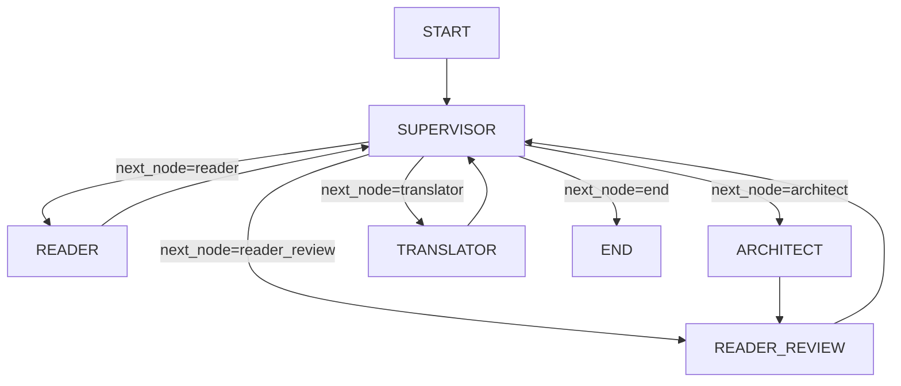

# Báo cáo: Workflow & Pipeline

## 1. Tổng quan

| Thuộc tính | Chi tiết |
|---|---|
| **File chính** | `src/workflow.py` |
| **Entry points** | `main.py`, `scripts/run_local_pipeline.py` |
| **Framework** | LangGraph (LangChain) |
| **State** | `GlobalState` (TypedDict trong `src/models/state.py`) |

## 2. Kiến trúc Pipeline



**Luồng hoạt động:**
1. **Supervisor** — phân tích state, quyết định node tiếp theo
2. **Reader** — khám phá codebase, trích xuất dependencies và deprecated APIs
3. **Architect** — lập kế hoạch migration dựa trên dữ liệu từ Reader
4. **Reader Review** — chọn giải pháp tốt nhất từ candidate solutions
5. **Translator** — thực hiện thay đổi code theo kế hoạch từ Architect
6. Sau mỗi node, quay lại **Supervisor** để quyết định bước tiếp theo
7. Khi hoàn thành, Supervisor route đến **END**

## 3. GlobalState Schema

```python
class GlobalState(TypedDict):
    # --- Core context ---
    project_path: str                    # Đường dẫn project Java
    target_java_version: str             # Target version (mặc định "17")
    project_type: Optional[str]          # Loại project (maven, gradle, unknown)
    source_framework: Optional[str]
    source_version: Optional[str]
    target_framework: Optional[str]
    target_version: Optional[str]

    # --- Chat history (Human <-> Supervisor) ---
    messages: Annotated[list[BaseMessage], operator.add]

    # --- Completed work summaries ---
    completed_tasks_summary: Annotated[list[str], operator.add]

    # --- Reader output ---
    pom_data: Optional[dict]
    dependencies: list
    index_report: Optional[dict]

    # --- Architect output ---
    upgrade_report: Optional[dict]
    candidate_solutions: Optional[list]
    compatibility_matrix: dict
    reader_review: Optional[dict]

    # --- jdeprscan output ---
    jdeprscan_report: Optional[dict]

    # --- Migration tasks ---
    migration_tasks: list

    # --- Routing ---
    current_instruction: str
    last_subagent_result: str
    next_node: str
```

## 4. Entry Points

### 4.1. `main.py`
- Entry point chính cho CLI
- Parse arguments (project_path, target_version)
- Khởi tạo workflow và chạy

### 4.2. `scripts/run_local_pipeline.py`
- Script chạy pipeline locally
- Hỗ trợ cấu hình qua command line

### 4.3. `scripts/orchestrator_runner.py`
- Chạy orchestrator với cấu hình cụ thể
- Hỗ trợ batch processing

### 4.4. `scripts/run_translator_smoke.py`
- Smoke test cho translator agent
- Kiểm tra AST transformation hoạt động đúng

## 5. Configuration

**Environment Variables (`.env`):**
```
GROQ_API_KEY=xxx
GROQ_MODEL=llama-3.3-70b-versatile
```

**Dependencies** (`pyproject.toml`, `requirements.txt`):
- `langchain`, `langchain-groq`, `langchain-core`
- `tree-sitter`, `tree-sitter-java`
- `python-dotenv`
- `networkx`, `matplotlib` (visualization)
- `z3-solver` (optional, SAT solving)
- Các thư viện utility khác

## 6. Node Wrappers

Mỗi agent được wrap thành LangGraph node function:

| Node | Wrapper Function | Agent | Mô tả |
|---|---|---|---|
| `supervisor` | `get_supervisor_node()` | SupervisorAgent | Điều phối workflow |
| `reader` | `reader_node()` | ReaderAgent | Khám phá codebase |
| `architect` | `architect_node()` | ArchitectAgent | Lập kế hoạch nâng cấp |
| `reader_review` | `reader_review_node()` | ReaderAgent | Chọn giải pháp tốt nhất |
| `translator` | `translator_node()` | TranslatorAgent | Thực hiện migration |

## 7. Human-in-the-Loop

Workflow hỗ trợ 2 mode:
- **interrupt=True** (mặc định): Pause trước mỗi supervisor turn, cho phép human review
- **interrupt=False**: Pipeline chạy end-to-end không pause (cho testing/batch)

```python
app = build_app(interrupt=True)   # Human-in-the-loop
app = build_app(interrupt=False)  # Automated
```

## 8. Vấn đề & Cải tiến tiềm năng

| Vấn đề | Hiện tại | Đề xuất |
|---|---|---|
| State management | GlobalState là TypedDict, không có validation | Nên chuyển sang Pydantic model |
| Error recovery | Không có cơ chế retry khi node fail | Pipeline dừng hoàn toàn | Thêm retry logic và error boundaries |
| Parallel execution | Các node chạy tuần tự | Có thể parallel hóa một số bước (vd: jdeprscan + dependency analysis) |
| Checkpointing | Không lưu intermediate state | Nếu pipeline crash, phải chạy lại từ đầu | Thêm checkpoint sau mỗi node |
| Observability | Chỉ có `print()` statements | Cần proper logging framework (structlog, etc.) |
| Agent instantiation | Mỗi node tạo mới agent | Nên dùng singleton hoặc dependency injection |

---
*Báo cáo tạo ngày: 2026-06-05*