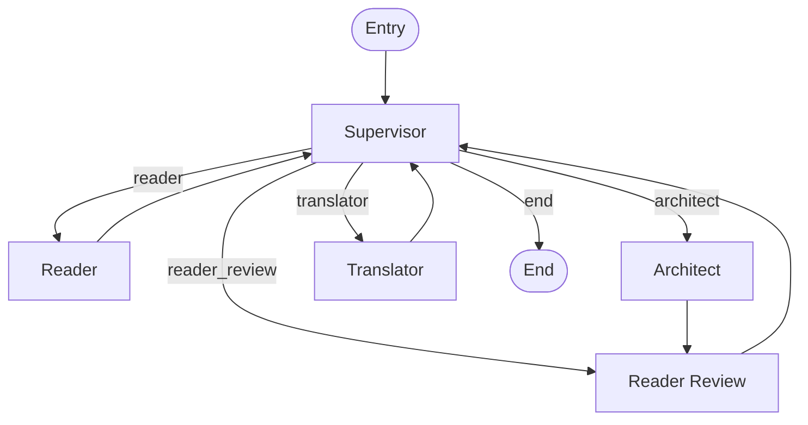
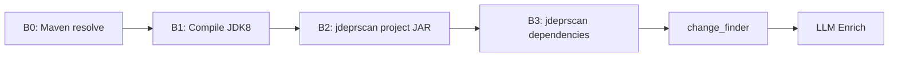
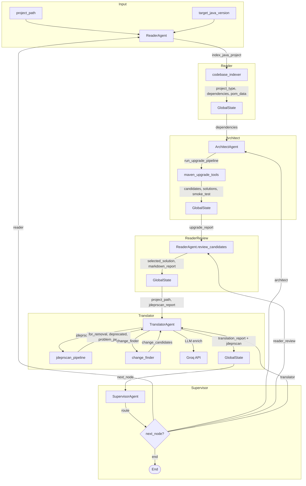

# Báo cáo Tổng quan Luồng Hoạt động MYGRATE
> Ngày: 2026-06-04
> Phiên bản snapshot: `src/` tại commit hiện tại

---

## 1. Tổng quan Kiến trúc

MYGRATE là một **multi-agent migration assistant** dựa trên LangGraph, thiết kế để hỗ trợ nâng cấp dự án Java (đặc biệt JDK 8 → 17/21). Hệ thống gồm 5 node trong một `StateGraph`:



**Luồng chính:**
1. **Supervisor** phân tích state → quyết định route đến node nào
2. **Reader** index codebase, parse POM, trả về dependencies
3. **Architect** chạy 7-step dependency pipeline (fetch → filter → static → compile → constraint → Z3 solver → smoke test)
4. **Reader Review** chọn best candidate, viết migration rationale
5. **Translator** chạy jdeprscan B0-B3 → build change plan → enrich bằng LLM

---

## 2. Chi tiết từng Thành phần

### 2.1. GlobalState (`src/models/state.py`)

| Field | Type | Mô tả |
|---|---|---|
| `project_path` | `str` | Đường dẫn dự án |
| `target_java_version` | `str` | JDK target (default "17") |
| `project_type` | `Optional[str]` | "java" / "python" / "mixed" |
| `source_framework` | `Optional[str]` | Framework nguồn |
| `source_version` | `Optional[str]` | Version nguồn |
| `target_framework` | `Optional[str]` | Framework đích |
| `target_version` | `Optional[str]` | Version đích |
| `messages` | `Annotated[list[BaseMessage], operator.add]` | Chat history |
| `completed_tasks_summary` | `Annotated[list[str], operator.add]` | Tóm tắt công việc đã xong |
| `pom_data` | `Optional[dict]` | POM parsed data (từ Reader) |
| `dependencies` | `list` | Danh sách dependencies (từ Reader) |
| `index_report` | `Optional[dict]` | Báo cáo index (từ Reader) |
| `upgrade_report` | `Optional[dict]` | Báo cáo upgrade pipeline (từ Architect) |
| `candidate_solutions` | `Optional[list]` | Các solution candidates |
| `compatibility_matrix` | `dict` | Conflict edges |
| `reader_review` | `Optional[dict]` | Final review (từ Reader Review) |
| `jdeprscan_report` | `Optional[dict]` | **[MỚI]** Báo cáo jdeprscan B0-B3 (từ Translator) |
| `migration_tasks` | `list` | Các task migration |
| `current_instruction` | `str` | Instruction hiện tại |
| `last_subagent_result` | `str` | Kết quả sub-agent gần nhất |
| `next_node` | `str` | Node tiếp theo Supervisor route |

### 2.2. Supervisor (`src/agents/supervisor.py`)

- **LLM-driven**: Dùng `ChatGroq` (model `llama-3.3-70b-versatile`) để phân tích state và quyết định routing
- **Prompt**: Load từ `src/prompts/supervisor.md`
- **Context**: Build state context string từ `project_path`, `project_type`, `target_java_version`, `dependencies`, `last_subagent_result`, `completed_tasks_summary`
- **Output**: JSON với `next_node`, `current_instruction`, `summary_update`, `response_to_user`
- **Routing**: Conditional edges dựa trên `next_node` field

### 2.3. Reader (`src/agents/reader_agent.py`)

**Hai chế độ:**

1. **Index mode** (`run()`):
   - Gọi `index_java_project()` từ `maven_upgrade_tools`
   - Parse POM, detect project type, extract dependencies
   - Trả về JSON: `status`, `project_type`, `dependencies`, `pom_data`, `index_summary`

2. **Review mode** (`review_candidates()`):
   - Được gọi khi instruction chứa "candidate solutions" / "final review"
   - Chọn best solution dựa trên smoke test results + compatibility scoring
   - Tạo markdown report với: Current Codebase, Candidate Solutions, Selected Recommendation, Why This Choice, Remaining Risks, Next Steps
   - Scoring: `(pass_bonus, compatible, -warnings, upgrade_count, freshness_score, len)`

### 2.4. Architect (`src/agents/architect_agent.py`)

- **Pure tool-driven** (không dùng LLM)
- Gọi `run_upgrade_pipeline()` từ `maven_upgrade_tools`
- 7-step pipeline:
  1. Fetch candidate versions từ Maven Central
  2. Heuristic filter (remove alpha/beta/snapshot)
  3. Static bytecode check (JDK compatibility + Java EE refs)
  4. Compile check (`javac --release`)
  5. Transitive constraint modeling (deps.dev API)
  6. SAT/SMT solver (Z3 hoặc backtracking fallback)
  7. Runtime smoke test (JVM class loading)
- Output: `candidates`, `conflict_edges`, `solutions`, `smoke_test_results`, `best_solution`

### 2.5. Translator (`src/agents/translator_agent.py`)

**Workflow 3 bước:**



1. **Step 1 — jdeprscan pipeline (B0-B3)**:
   - `_run_jdeprscan()`: Gọi `run_jdeprscan_pipeline()`
   - Auto-detect JDK 8 và JDK 17
   - 3-layer analysis: project code, dependencies, pom.xml
   - Graceful fallback: nếu pipeline fail, vẫn tiếp tục với change_finder data

2. **Step 2 — Build translation report**:
   - Gọi `build_translation_report()` từ `change_finder`
   - Merge `dependency_focus_scopes.json` + `affected_scopes.json`
   - Tạo `change_candidates` list

3. **Step 3 — LLM enrichment** (optional):
   - Nếu có `GROQ_API_KEY`, enrich report bằng LLM
   - System prompt bao gồm jdeprscan context (3-layer analysis)
   - Nếu không có LLM, trả về deterministic report

### 2.6. Workflow Nodes (`src/workflow.py`)

| Node | Input từ State | Output vào State |
|---|---|---|
| `reader_node` | `project_path`, `target_java_version` | `project_type`, `dependencies`, `pom_data`, `index_report` |
| `architect_node` | `dependencies`, `target_java_version` | `candidate_solutions`, `upgrade_report`, `compatibility_matrix` |
| `reader_review_node` | `upgrade_report`, `project_path`, `dependencies`, `pom_data` | `reader_review`, `upgrade_report` (updated) |
| `translator_node` | `project_path`, `target_java_version`, `migration_tasks`, `dependencies`, `pom_data`, `jdeprscan_report`, etc. | `last_subagent_result`, `jdeprscan_report` |

---

## 3. Tools & Utilities

### 3.1. jdeprscan Pipeline (`src/tools/jdeprscan_pipeline.py`)

**Entry point:** `run_jdeprscan_pipeline(project_path, target_release, jdk8_home, jdk17_home, n_workers, logger)`

| Step | Function | Mô tả |
|---|---|---|
| B0 | `_step_b0_maven()` | Maven resolve dependencies (có caching theo pom.xml mtime) |
| B1 | `_step_b1_compile()` | Compile project bằng JDK 8 (conditional tools.jar) |
| B2 | `_step_b2_project_scan()` | jdeprscan project JAR (JDK 17) |
| B3 | `_step_b3_dep_scan()` | jdeprscan từng dependency JAR (multi-threaded) |

**Utility functions:** `find_jdk()`, `find_jdeprscan()`, `find_maven()`, `build_classpath()`, `scan_jar()`, `jar_prefix()`

**Output structure:**
```json
{
  "status": "OK|PARTIAL|FAIL",
  "project_path": "...",
  "target_release": "17",
  "jdk8_home": "...",
  "jdk17_home": "...",
  "jdeprscan_path": "...",
  "steps": {
    "b0_maven": { "status", "jar_count", "classpath_jars", "classpath", "needs_tools_jar", "dep_dir" },
    "b1_compile": { "status", "class_count", "jar_path", "compile_cp" },
    "b2_project_scan": { "status", "for_removal", "deprecated", "for_removal_count", "deprecated_count" },
    "b3_dep_scan": { "status", "total_jars", "problem_jars", "clean_jars", "timeout_jars", "ecosystems" }
  },
  "summary": {
    "project_code": { "for_removal_count", "deprecated_count", "clean" },
    "dependencies": { "problem_count", "critical_count", "top_issues" },
    "pom_xml": { "critical_deps", "critical_count" }
  },
  "errors": ["..."]
}
```

### 3.2. Maven Upgrade Tools (`src/tools/maven_upgrade_tools.py`)

**Entry points:**
- `index_java_project()` — lightweight index + POM parse (cho Reader)
- `run_upgrade_pipeline()` — full 7-step analysis (cho Architect)
- `build_java_upgrade_report()` — backward-compatible wrapper

**Key classes/functions:** `DependencySolver`, `heuristic_filter()`, `check_java_compatibility()`, `run_compile_check()`, `run_runtime_smoke_test()`, `solve_with_z3()`, `build_library_resolutions()`, `analyze_dependency_conflicts()`, `inject_constrained_versions()`

### 3.3. Change Finder (`src/tools/change_finder.py`)

- `find_change_candidates()` — Build deterministic list of migration targets từ report artifacts
- `build_translation_report()` — Wrapper tạo full translation report
- Data classes: `ChangeCandidate(file_path, start_line, end_line, match_type, dependency, reason, snippet)`
- Clustering: `_cluster_lines()` gom các hit_lines gần nhau (gap=2)

### 3.4. Codebase Indexer (`src/tools/codebase_indexer.py`)

- `index_codebase()` — Walk project directory, detect language, collect manifests
- Returns: `project_type`, `language_counts`, `source_files`, `manifest_files`, `notebooks`

### 3.5. File System Tools (`src/tools/file_system.py`)

- `list_project_structure()` — LangChain `@tool`, trả về tree visualization
- `read_source_code()` — LangChain `@tool`, đọc file content
- `get_file_summary()` — LangChain `@tool`, tóm tắt file

### 3.6. Visualization Engine (`src/tools/visualization_engine.py`)

- `generate_dashboard()` — Tạo dependency graph PNG
- `generate_cross_matrix()` — Tạo cross-compatibility matrix

### 3.7. AST Parser (`src/ast_parser/transformer.py`)

- `TypeHintModernizer` — Python AST transformer: `Union[X, Y]` → `X | Y`, `Optional[X]` → `X | None`
- PEP 604 compliance

### 3.8. Tree-sitter Engine (`src/core/tree_sitter_engine.py`)

- `UniversalASTReader` — Parse Python/Java source code bằng tree-sitter
- `parse()` → `tree_sitter.Tree`
- `query()` → S-expression queries

### 3.9. Data Distillation (`src/data_distillation/`)

- `rule_extractor.py` — Extract migration rules từ OpenRewrite YAML recipes
- Rules: `ChangePackage`, `ChangeMethodName`, `ChangeType`, `ChangeLiteral`, etc.
- Pre-built rules: `java-version-8.yml`, `java-version-11.yml`, `java-version-17.yml`, `java-version-21.yml`, `java-version-25.yml`

---

## 4. Scripts & Entry Points

| Script | Mô tả |
|---|---|
| `src/main.py` | CLI entry point. Args: `--path`, `--target-java`, `--approve` |
| `scripts/orchestrator_runner.py` | LangGraph workflow runner (human-in-the-loop) |
| `scripts/run_local_pipeline.py` | **Placeholder** — dependency analysis features removed |
| `scripts/run_translator_smoke.py` | CLI smoke test cho TranslatorAgent |
| `scripts/setup_project.py` | Project scaffolding script |

---

## 5. Đang Hoạt động Tốt

| Thành phần | Status | Ghi chú |
|---|---|---|
| LangGraph StateGraph | ✅ Hoạt động | 5 nodes, conditional edges, MemorySaver |
| Supervisor routing | ✅ Hoạt động | LLM-driven, JSON output |
| Reader (index mode) | ✅ Hoạt động | POM parse, dependency extraction |
| Reader (review mode) | ✅ Hoạt động | Candidate scoring, markdown report |
| Architect 7-step pipeline | ✅ Hoạt động | Full deterministic pipeline |
| Translator jdeprscan B0-B3 | ✅ Hoạt động | Multi-threaded, caching, conditional tools.jar |
| Translator change_finder | ✅ Hoạt động | Deterministic report from artifacts |
| Translator LLM enrichment | ✅ Hoạt động | Groq API, jdeprscan-aware prompt |
| jdeprscan_pipeline tool | ✅ Hoạt động | Standalone, reusable, no hardcoded strings |
| GlobalState jdeprscan_report | ✅ Hoạt động | Field added, passed through workflow |
| Workflow translator_node | ✅ Hoạt động | Passes jdeprscan_report, extracts result |
| Supervisor prompt | ✅ Hoạt động | Documents jdeprscan workflow |
| Data distillation rules | ✅ Hoạt động | OpenRewrite YAML extraction |
| Tree-sitter engine | ✅ Hoạt động | Python + Java parsing |
| AST modernizer | ✅ Hoạt động | PEP 604 type hints |

---

## 6. Cái gì đang THIẾU (Gaps & Missing Pieces)

### 6.1. 🔴 Critical — Workflow End-to-End chưa chạy hoàn chỉnh

| Gap | Mô tả | Ảnh hưởng |
|---|---|---|
| **Không có auto-continue loop** | `orchestrator_runner.py` có loop `while True` nhưng `src/main.py` chỉ gọi `app.invoke()` một lần. Human-in-the-loop cần resume thủ công. | Pipeline dừng sau mỗi supervisor turn |
| **Supervisor JSON parse fragile** | Nếu LLM trả về markdown-wrapped JSON hoặc format sai, supervisor fallback về `end`. Không có retry. | Pipeline terminate sớm |
| **State không persist giữa sessions** | MemorySaver chỉ in-memory. Không có database/file checkpoint. | Mất state khi restart |
| **`migration_tasks` luôn rỗng** | Không có node nào populate `migration_tasks` từ reader/architect output. Translator nhận list rỗng. | Change plan thiếu context |

### 6.2. 🔴 Critical — Translator chưa thực hiện code transformation

| Gap | Mô tả |
|---|---|
| **Không có code patching** | Translator chỉ tạo *change plan* (danh sách candidates) nhưng **không viết patch hay sửa file**. Không có logic apply changes. |
| **Không có file write-back** | Không có tool nào trong Translator để ghi thay đổi vào source files. |
| **Không có AST-based transformation** | `ast_parser/transformer.py` chỉ modernize Python type hints. Không có Java AST transformer cho migration. |
| **Data distillation rules không được dùng** | `rule_extractor.py` extract OpenRewrite rules nhưng không có code nào consume rules để apply transformations. |

### 6.3. 🟡 Medium — Agent Communication & State

| Gap | Mô tả |
|---|---|
| **Reader → Architect handoff incomplete** | `reader_node` parse JSON từ ReaderAgent output nhưng không validate structure. Nếu Reader trả format khác, Architect nhận dependencies rỗng. |
| **Architect → Reader Review** | `architect_node` hardcode route đến `reader_review` trong workflow graph (`workflow.add_edge("architect", "reader_review")`). Nếu Architect fail, vẫn route đến review. |
| **Translator không nhận upgrade_report đầy đủ** | `translator_node` truyền `upgrade_report` và `reader_review` nhưng TranslatorAgent.run() không sử dụng trực tiếp — chỉ dùng `change_finder` artifacts. |
| **jdeprscan_report không được truyền giữa sessions** | Nếu pipeline chạy lại, jdeprscan_report cũ bị mất vì không persist. |

### 6.4. 🟡 Medium — Error Handling & Resilience

| Gap | Mô tả |
|---|---|
| **Không có retry logic** | Maven, jdeprscan, compile — tất cả đều single-attempt. Network timeout = pipeline fail. |
| **Không có partial result recovery** | Nếu B1 compile fail, B2/B3 skip hoàn toàn. Không có fallback scan bằng existing JARs. |
| **jdeprscan pipeline silent skip** | Nếu JDK 8 không tìm thấy, B1 skip → B2 skip → chỉ có B3 dependency scan. Không có warning rõ ràng cho user. |
| **LLM error = silent fallback** | Nếu Groq API fail, Translator trả deterministic report. Không log error, không retry. |

### 6.5. 🟡 Medium — Testing & Quality

| Gap | Mô tả |
|---|---|
| **Test coverage thấp** | Chỉ có `tests/test_translator_agent.py` (2 test cases). Không có test cho: Supervisor, Reader, Architect, workflow, jdeprscan pipeline, maven_upgrade_tools. |
| **Không có integration test** | Không test end-to-end workflow (Reader → Architect → Review → Translator). |
| **Không có mock cho external tools** | Maven, jdeprscan, Groq API — tất cả gọi trực tiếp. Không có mock layer. |
| **`run_tests.py` không test gì đặc biệt** | File tồn tại nhưng nội dung không rõ ràng. |

### 6.6. 🟢 Low — Documentation & DX

| Gap | Mô tả |
|---|---|
| **Docs outdated** | `docs/architecture.md` mô tả flow cũ (AST → Architect → Translator). Không mention jdeprscan, không mention LangGraph. |
| **Docs outdated** | `docs/api_reference.md` liệt kê signature cũ, không có jdeprscan_pipeline, change_finder. |
| **Docs outdated** | `docs/usage.md` mô tả CLI args không tồn tại (`--input`, `--output`, `--profile`, `--dry-run`). |
| **README.md** | Chỉ có title, không có nội dung. |
| **Không có `.env.example`** | User không biết cần set `GROQ_API_KEY`, `JAVA_HOME`, etc. |
| **`scripts/run_local_pipeline.py`** | Placeholder — "features removed". Không có fallback thực sự. |

---

## 7. Placeholder & Stub Code

| File | Placeholder | Mô tả |
|---|---|---|
| `scripts/run_local_pipeline.py` | `print("[run_local_pipeline] Dependency analysis features have been removed...")` | Toàn bộ file là placeholder, return 0 |
| `src/ast_parser/transformer.py` | Chỉ transform Python type hints | Không có Java AST transformation |
| `src/core/tree_sitter_engine.py` | Parse + query only | Không có transformation/write-back capability |
| `src/tools/file_system.py` | `read_source_code()`, `list_project_structure()` | Đọc-only, không có `write_source_code()` hay `apply_patch()` |
| `src/tools/visualization_engine.py` | `generate_dashboard()`, `generate_cross_matrix()` | Chỉ visualization, không có transformation |
| `src/models/schemas.py` | `MigrationTask` model | Được định nghĩa nhưng **không được sử dụng ở đâu** trong codebase |
| `src/data_distillation/src/rule_extractor.py` | Extract rules từ YAML | Rules được extract nhưng **không được consume** bởi bất kỳ agent nào |
| `src/data_distillation/links.txt` | File text | Không rõ mục đích, không được reference |
| `src/agents/reader.py` | File tồn tại | **Placeholder** — không có nội dung thực tế, ReaderAgent nằm ở `reader_agent.py` |
| `freshbrew_data/cantor/utils/minhash_k.py` | Utility | Không được sử dụng trong pipeline chính |
| `runtime_test_jars/` | Directory | Không rõ mục đích, không được reference trong code |

---

## 8. Data Flow Chi tiết



---

## 9. External Dependencies & Requirements

| Dependency | Mục đích | Required? |
|---|---|---|
| `langchain` / `langgraph` | Workflow orchestration | ✅ Yes |
| `langchain-groq` | LLM API (Supervisor, Reader review, Translator enrichment) | ✅ Yes |
| `z3-solver` | SAT/SMT constraint solving (Architect step 6) | ⚠️ Optional (fallback exists) |
| `tree-sitter` + `tree-sitter-java` + `tree-sitter-python` | AST parsing | ✅ Yes |
| `networkx` + `matplotlib` | Dependency graph visualization | ⚠️ Optional |
| `requests` | Maven Central API, deps.dev API | ✅ Yes |
| `pydantic` | Data validation | ✅ Yes |
| `python-dotenv` | Environment variables | ✅ Yes |
| `pyyaml` | OpenRewrite rule parsing | ✅ Yes |
| **JDK 8** | Compile old Java projects (jdeprscan B1) | ⚠️ Optional (skip if not found) |
| **JDK 17+** | jdeprscan tool (B2, B3) | ⚠️ Optional (skip if not found) |
| **Maven** | Dependency resolution (B0) | ⚠️ Optional (fallback to existing JARs) |
| **Groq API Key** | LLM calls | ⚠️ Optional (fallback to deterministic) |

---

## 10. Tóm tắt Priority Actions

### 🔴 P0 — Must Have for MVP

1. **Implement code transformation in Translator** — Hiện tại Translator chỉ tạo plan, không apply changes. Cần thêm:
   - Java source file writer/patcher
   - Integration với data_distillation rules
   - POM.xml transformer (version upgrades)

2. **Fix workflow auto-continue** — `src/main.py` cần loop cho đến khi `next_node == "end"` thay vì single invoke.

3. **Populate `migration_tasks`** — Cần node hoặc logic để convert `reader_review.selected_solution` thành `migration_tasks` trước khi route đến Translator.

### 🟡 P1 — Should Have

4. **Add retry/resilience** — Maven, jdeprscan, compile nên có retry logic (2-3 attempts).

5. **Add integration tests** — Test end-to-end workflow với mock data.

6. **Update documentation** — `docs/architecture.md`, `docs/api_reference.md`, `docs/usage.md` cần cập nhật.

7. **Add `.env.example`** — Document required environment variables.

### 🟢 P2 — Nice to Have

8. **Persist state** — File-based hoặc SQLite checkpoint cho LangGraph.

9. **Remove dead code** — `src/agents/reader.py`, `src/models/schemas.py` (MigrationTask), `scripts/run_local_pipeline.py`.

10. **Add logging framework** — Thay `print()` bằng `logging` module.

11. **Supervisor JSON parse resilience** — Retry hoặc structured output parsing.

---

*End of report.*