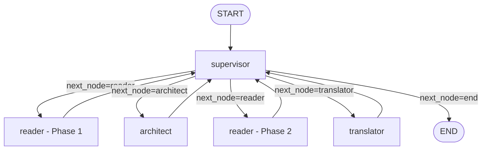

# Báo cáo: Giao thức và Phối hợp Workflow (0610 Update)

## 1. Tổng quan

| Thuộc tính | Chi tiết |
|---|---|
| **File chính** | [workflow.py](file:///d:/capstone_project/MYGRATE---Capstone-Project/src/workflow.py) |
| **Entry Point** | [main.py](file:///d:/capstone_project/MYGRATE---Capstone-Project/src/main.py) |
| **Framework** | LangGraph (LangChain) |
| **State** | `GlobalState` (định nghĩa trong [state.py](file:///d:/capstone_project/MYGRATE---Capstone-Project/src/models/state.py)) |

---

## 2. Kiến trúc Luồng Phối hợp (Workflow Graph)

Kiến trúc chuyển hướng điều phối trong bản cập nhật 0610 được thiết kế dưới dạng đồ thị có hướng (Directed Graph) được điều khiển bởi Supervisor Agent.

### 2.1. Quy trình tuần tự thực tế (E2E Loop)
1. **Khởi động**: Pipeline bắt đầu tại `supervisor`.
2. **Khám phá ban đầu**: Supervisor nhận diện dự án chưa được quét, chuyển tiếp sang `reader`.
3. **Pha 1 (Reader Scan)**: `ReaderAgent` quét cấu trúc thư mục, đếm mã nguồn, tìm dependencies, kiểm tra báo cáo jdeprscan cũ, xác định phân loại Green/Yellow/Red, lưu báo cáo vào `artifacts/reader_scan_report.*` và trả quyền điều khiển về `supervisor`. Gặp node `end` để chờ con người phê duyệt.
4. **Giải quyết tương thích**: Sau khi con người phê duyệt, Supervisor chuyển sang `architect`. `ArchitectAgent` chạy 7 bước phân tích tương thích, SAT solver (Z3), JVM smoke test, lưu `upgrade_report.json` và trả quyền điều khiển về `supervisor`.
5. **Pha 2 (Reader Review)**: Supervisor tự động chuyển tiếp sang `reader` lần thứ hai. `ReaderAgent` chấm điểm các giải pháp từ bộ giải, chọn phương án tối ưu, xuất báo cáo `reader_review.*` sang `artifacts/` và trả quyền điều khiển về `supervisor`. Lúc này gặp node `end` dừng lại chờ phê duyệt áp dụng thay đổi mã nguồn.
6. **Thực thi dịch chuyển code**: Khi được phê duyệt, Supervisor chuyển sang `translator`. `TranslatorAgent` quét API lỗi, tạo kế hoạch thay đổi, chỉnh sửa POM và mã nguồn Java, lưu thay đổi vào `/artifacts`, biên dịch thử bằng Maven để kiểm chứng và trả quyền điều khiển về `supervisor`.
7. **Hoàn thành**: Supervisor nhận diện kế hoạch thay đổi đã hoàn tất, chuyển quyền điều khiển đến `end` và kết thúc luồng.

---

## 3. GlobalState Schema

Trạng thái toàn cục `GlobalState` điều hành việc trao đổi thông tin giữa các agent:
- `project_path`: Đường dẫn đến mã nguồn dự án mục tiêu.
- `target_java_version`: Phiên bản JDK mục tiêu nâng cấp (ví dụ: "17").
- `project_type`: Ngôn ngữ hoặc công nghệ (ví dụ: "java").
- `messages`: Lịch sử các tin nhắn giao tiếp giữa Supervisor và người dùng (LangChain Human/AIMessage).
- `completed_tasks_summary`: Danh sách các tác vụ đã hoàn thành trong toàn bộ pipeline.
- `pom_data` / `dependencies` / `index_report`: Dữ liệu phân tích cấu trúc dự án từ Reader Pha 1.
- `upgrade_report` / `candidate_solutions` / `compatibility_matrix`: Kết quả phân tích độ tương thích thư viện của Architect.
- `reader_review`: Báo cáo đánh giá và lựa chọn cấu hình thư viện tối ưu từ Reader Pha 2.
- `jdeprscan_report`: Báo cáo chẩn đoán API JDK deprecated từ Translator.
- `migration_tasks`: Danh sách các tệp tin cần chỉnh sửa mã nguồn.
- `next_node` / `current_instruction` / `last_subagent_result`: Các tham số định tuyến trạng thái của LangGraph.

---

## 4. Chế độ tương tác Human-in-the-Loop

Workflow hỗ trợ hai cơ chế thực thi:
1. **Human-in-the-Loop Mode (interrupt=True)**:
   - Mặc định khi chạy CLI không có cờ `--approve`.
   - Pipeline tự động dừng lại trước mỗi quyết định lớn (sau khi quét xong, sau khi giải quyết tương thích xong, sau khi tạo xong kế hoạch dịch chuyển) để người dùng xem báo cáo và nhập văn bản chỉ thị/phê duyệt từ bàn phím.
2. **Auto-Approval Mode (interrupt=False)**:
   - Kích hoạt bằng cách truyền cờ `--approve` trong CLI.
   - Sử dụng cho việc tích hợp CI/CD hoặc chạy hàng loạt (batch). Pipeline sẽ giả lập phê duyệt tự động và chạy liên tục từ đầu đến cuối.

---
*Báo cáo tạo ngày: 2026-06-10*
